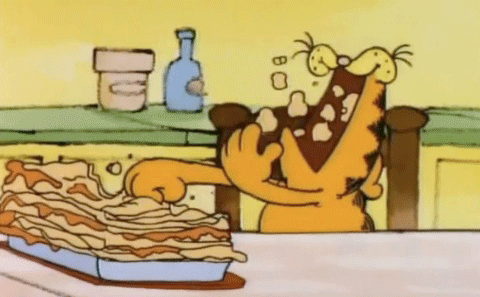

#   ESPAÑOL:

## <i align="center" style="font-size:2rem">🍗 APP DE COMIDAS CON REACT</i>

En este proyecto se usaron hooks como  **useState,useEffect,useContext** , tecnologias como **HTML,CSS,Javascript,React,Sass,Bootstrap** y para el manejo de rutas **React Router**

_Este proyecto fue desarrollado con el proposito de practicar React_

## 💡 Como se penso este proyecto y como funciona

**_Idea Principal :  Hacer una aplicacion de comida que posea diferentes categorias y dentro de cada categoria tener diferentes comidas y que posea informacion detallada de cada comida_**

Api utilizada en este proyecto:
- [MealApi](https://www.themealdb.com/api.php)

Bueno ,primero que nada organice la aplicacion en diferentes rutas/paginas/vistas , la primera de todas llamda **_"Home"_**. Realice diferentes componentes para esta vista : "Navbar" ,"Header" sin la funcion de la barra de busqueda, "Categorias" y "Search Results" pero esto lo desarrollare un poco mas adelante 

Cree un contexto para manejar el estado general de la aplicacion. El primer desafio fue obtener las diferentes categorias, para eso creé un estado llamado **_"categories"_** y con un efecto realice una peticion fetch a la api en el "endpoint" (www.themealdb.com/api/json/v1/1/categories.php) y con los resultados que trajo se completo el estado.Al estar lleno el estado renderice el componente **_"Categories"_** y llene la barra de navegacion lateral.

Luego creé una segunda vista/ruta/pagina llamada **_"Individual Category"_**. El usuario puede acceder a esta vista de cada categoria apretando el boton "ver mas" dentro de cada categoria o apretando el nombre de la categoria en la barra de navegacion lateral. En cualquier de los dos casos se rellenera el estado con la categoria seleccionada y se realizara una peticion para obtener las diferentes comidas correspondientes.

El estado llamado **_"categorySelected"_** contiene la diferente informacion sobre la categoria seleccionada y otro estado llamado **_"mealsCategory"_** contiene toda la comida que pertenece a esa categoria.

En la segunda vista/pagina/ruta , el usuario puede ver mas informacion sobre cada comida o ir a la pagina anterior. Si el usuario ahce click en el boton "back", ira a la vista "Home". Si el usuario hace click in "ver mas" podra ver mas informacion acerca de esa comida.

Cree un estado llamado **_"meal"_** que se llena cuando el usuario hace click en "ver mas", por que la aplicacion realiza una peticion fetch a la api econ el nombre de la comida , en el endpoint ("www.themealdb.com/api/json/v1/1/search.php?s=").

En la tercer ruta/vista/pagina , el usuario puede ver la informacion detallada de la comida seleccionada

Retrocediendo un poco ,en la primera vista, cuando finalice lo anterior mencionado ,termine la barra de busqueda. Realice un estado para manejar la informacion contenida dentro de la barra de busqueda y a este estado lo llame **_"search"_** y con la informacion de este estado , cuando el usuario hace click en el boton de busqueda, se realiza una peticion fetch al endpoint ("www.themealdb.com/api/json/v1/1/search.php?s=")  y con los resultados se almacenan en un estado llamado **_"searchResults"_**

Dentro de la vista/ruta/pagina "Home" , realice un renderizado condicional cuando **_"searchResults"_** posea algo. Cuando esto ocurra se renderizara el componente "Search Results" con las diferentes comidas que envia la respuesta de la API

La funcionalidad del componente  mencionado anteriormente es similar al compoennet de las diferentes comdias dentro de la vista "categorias". por lo tanto tambien posee un boton de "ver mas" para poder obtener mas informacion del alimento en cuestion.

Para  los estilos , utilice Bootstrap y SASS (Pero este ultimo para ajustes menores)

---------------------------------------------------------------------------------------------------------
---------------------------------------------------------------------------------------------------------

#  ENGLISH:

## <i align="center" style="font-size:2rem">🍟 MEAL APP WITH REACT</i> 

In this proyect was used hooks like **useState,useEffect,useContext** , technologies like **HTML,CSS,Javascript,React,Sass,Bootstrap** and for the route managment **React Router**

_This proyect was built with the purpose of practising React_

## 🤔 How i thought about the project and its functioning

**_Main Idea : Do a food app that contains diferent categories and into that categories ,have different foods also  can see information about each food_**

API used in this project : 
- [MealApi](https://www.themealdb.com/api.php)

Well,First of all I organized the app in the first route , it was Home . I maked the different components for this route : NavBar, Header without function of the search bar , Categories , and Search Results but I will write about it more ahead

I created a Context for handle the general state of the app. The first challenge was get the different categories . So I created a state called "categories" and with a useState I do a fetch to the api in the endpoint (www.themealdb.com/api/json/v1/1/categories.php) and with the results I set the state. With this information I rendered the Categories component and fill the side navbar

When I filled out that information then I created the second route of the App , called "Individual Category".User can access it when press the button "view more" into the individual card of each category or when uses the side bar and clicks in any category there . In either of the two cases it will fill a state with the category selected and do a fetch for get the differents foods

A state called "categorySelected" will contain different information about the category selected and another state called "mealsCategory" will contain  information about all the food that belong to the category Selected

Into the second route ,user can view more information about any food present here or go back .If the user clicks in the button back ,backs home page
If the user clicks in any view more then can see more information about it food

For the second option ,I make and state called "meal" that fills when user clicks the view more button , because the app do a fetch to the api in the endpoint ("www.themealdb.com/api/json/v1/1/search.php?s=") with the name of the food.

In the third route ,user can see the information about the food selected , thanks to the state "meal" that was filled previously

Backing backwards, in the first route when I finish the other stuff mentioned above, I finished the search bar .I make a state for handle the information into the search bar , this state was called "search" and with the information of it state , when user clicks button of search , it will make a fetch to the endpoint ("www.themealdb.com/api/json/v1/1/search.php?s=") and the results will storage in the state "searchResults"

Into the Home , I put a conditional render When "searchResults" has any, it will be render the Component Search Results with the differents foods of the response

The functioning of the cards results is the same of the different foods into the categories page. So when user clicks view more , can see different information about the food .

For the Styles , I used Bootstrap and SASS (for minor adjustments )